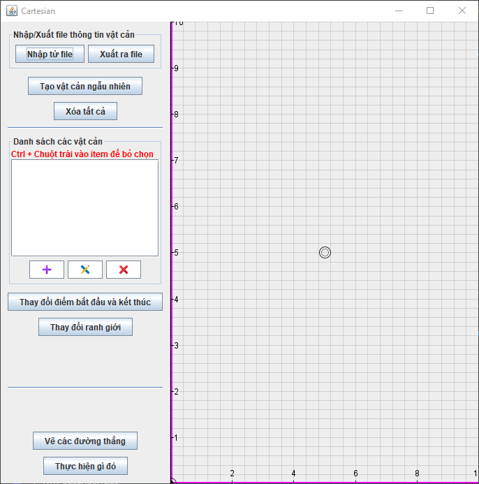
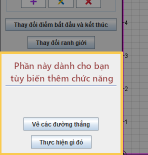

# Mô hình hóa môi trường 

Keywords: _`mobile robot`, `environmental modeling`, `path planning`_

Từ khóa: _`robot di động`, `rô bốt di động`, `mô hình hóa môi trường`, `lập lịch đường đi`_

## Giới thiệu

Mô hình hóa môi trường là bước quan trọng trong việc lập lịch đường đi cho robot di động. Dự án này cung cấp sẵn cho bạn một cái khung chương trình (sử dụng Java Swing) để tạo được một môi trường tĩnh 2D cơ bản, để bạn có thể tập trung phát triển/nghiên cứu/tìm hiểu thuật toán mà không cần phải bỏ thêm thời gian để code từ đầu.

Trong dự án này gồm:

* Thư viện vẽ hệ tọa độ Đề các (Descartes) - được phát triển từ thư viện jcoolib (xem [andern/jcoolib](https://github.com/andern/jcoolib)).

* Khung chương trình (nằm trong gói ```ai.envir_modeling.graph```), gồm các tính năng:

    - Xuất/Nhập file chứa tọa độ của các vật cản.
    - Tạo ngẫu nhiên các vật cản.
    - Xem danh sách các vật cản.
    - Thêm/Sửa/Xóa một vật cản.
    - Thay đổi điểm bắt đầu và kết thúc.
    - Thay đổi đường biên.
    - Một panel để bạn có thể tùy biến thêm các chức năng ([xem](#custom-panel)).

* Một ví dụ nhỏ (nằm trong gói ```ai.envir_modeling.example```).

Các icon trong dự án này được lấy từ [Icons8](https://icons8.com)

## Getting started

1. Để bắt đầu, bạn hãy clone/fork project này về local để có thể cập nhật thêm tính năng mới sau này.

2. Tạo 1 gói riêng cho dự án của bạn và copy các file nằm trong gói ```ai.envir_modeling.example``` vào.

3. Sửa lại tên package của các file vừa mới copy trong gói này.

4. Tất cả các công việc/tác vụ mà bạn cần làm (như: vẽ các điểm/đường thẳng, thuật toán tìm đường đi) được thực hiện trong file ```CustomActionPanel```.

5. Để lấy (danh sách) các đối tượng (đa giác, đường thẳng, điểm...) sử dụng biến ```cartesianPanel```

### Chú ý:

1. Các dòng code không được phép thay đổi khi copy file ```CustomActionPanel``` trong ví dụ gồm:

``` java
..  // Some code ...
..  // Khai báo biến
33  CCExtentSystem cartesianPanel;

..  // Some code ...
..  // Lấy instance
37  cartesianPanel = CCExtentSystem.getInstance();
```

2. Điểm bắt đầu và điểm kết thúc trên đồ thị sẽ ko thay đổi kích thước khi thu phóng.

3. Để thay đổi kích thước của panel mà bạn tùy biến, vào file ```App.java``` mà bạn đã copy, thay đổi dòng 23.

``` java
20  @Override
21  public void run() {
22      JPanel panel = new CustomActionPanel();
23      Dimension preferredSize = CartesianFrame.getDefaultPanelDimension();
24      CartesianFrame frame = new CartesianFrame(panel, preferredSize);
25      frame.showUI();
26  }
```

Screenshot
----

#### Chương trình



#### Custom panel



Known Issues
----

- [ ] Chức năng tạo vật cản ngẫu nhiên chưa tạo ra được một bản đồ hợp lý.

License
----

GPL-3.0
